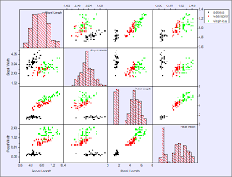
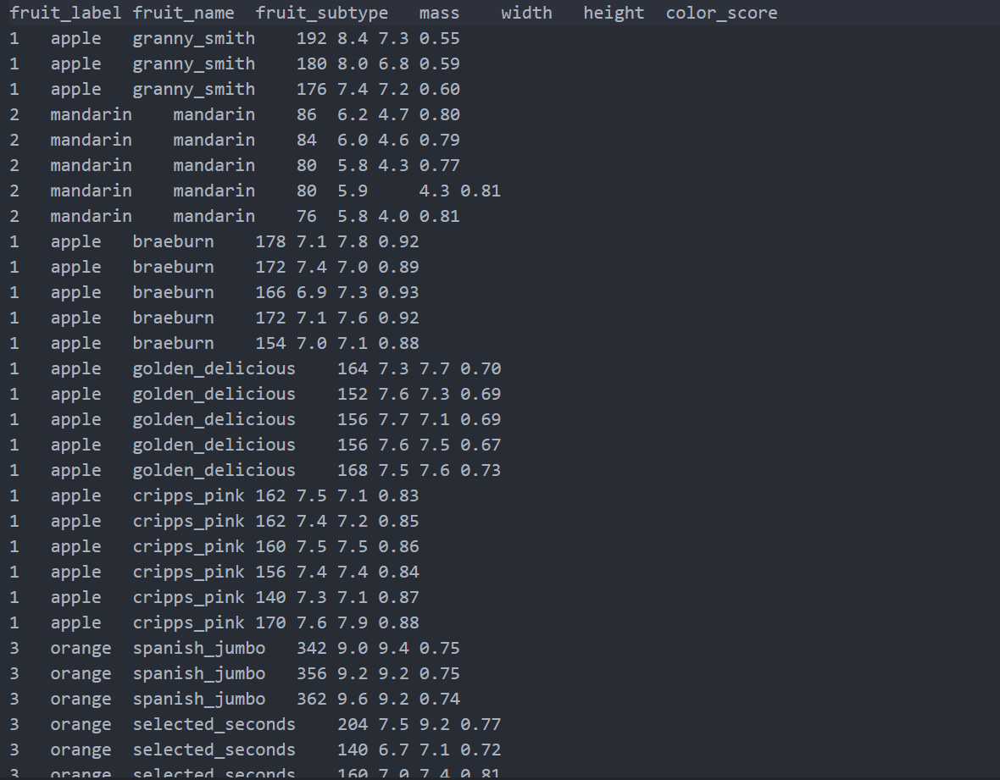

<h1><em><strong>What is scatter matrix</strong></em></h1>

 <strong>Scatter Matrix</strong> is a data visualization tool that shows the relationships between numerical variables in the form of a set of scatter plots. 

<h3><em><strong>Scatter matrix structure</strong></em></h3>

<ul>
<li><em>Axis</em>
 

Each column of data is plotted in pairs with other columns.

</li>

<li><em>Main diameter</em>
 

It usually displays the histogram or density of each feature (column).

</li>

<li><em>Outside the main diameter</em>
 

nemodar parakandegi bin npar do vijegi (do seton adadi) rasm mishod.
 A scatter plot is drawn between both features (two numerical columns).

</li>
</ul>

<h3><em><strong>Why useful is</strong></em></h3>

<ol>
<li><em>1- Check Scatter Matrix:</em>
 

Relation for linear or non-linear shows between variable

</li>

<li><em>2- Class Separation:</em>
 

Other points (Based on color) can be shows diferent between classifications(lables)

</li>

<li><em>3- Data Distribution:</em>
 

Through a histogram on the main diameter, the distribution of each variable is accessible

</li>
</ol>

<h3><em><strong>How to run</strong></em></h3>

in this example for scatter matrix use of simple fruits sorting data

<ol>
<li><em>import the required library:</em>
 

import pandas as pd
 
from pandas.plotting import scatter_matrix
 
from matplotlib import cm
 

</li>

<li><em>read file</em>
 

data=pd.read_table("fruits.txt")
 
<strong>description:</strong> The reason for using the read_table method in the pandas library is that our data set is a txt file containing tables

</li>

<li><em>division of x and y data:</em>
 

features_name = ['mass','width','height','color_score']
 
x=data[features_name]
 
y=data["fruits_lable"]
 

</li>

<li><em>create a scatter matrix: </em>
 

sc_matrx=scatter_matrix(x,c=y,marker='o',s=40,hist_kwds={'bind':15}, fig_size=(9,9), cmap=cmap)

 
<strong>descriptions:</strong>

arguments for scatter matrix
 
<strong>x</strong>: input data
 
<strong>c=y</strong>: any dot color with use of classification(lable) determind fruits
 
<strong>marker='o'</strong>: indicator type (marker) for data points
 
<strong>s=40</strong>: size data points
 
<strong>hist_kwds={'bins':15}</strong> : count of bin in histogram on main diameter
 
<strong>fig_size=(9,9)</strong>: size of diagram (w,h) to inch
 
<strong>cmap=cmap</strong>: use of selected color map for specifies scatter matrix color point

</li>

<li><em>define a cmap plan: </em>
 

cmap=cm.getcmap("gnuplot")

</li>

</ol>